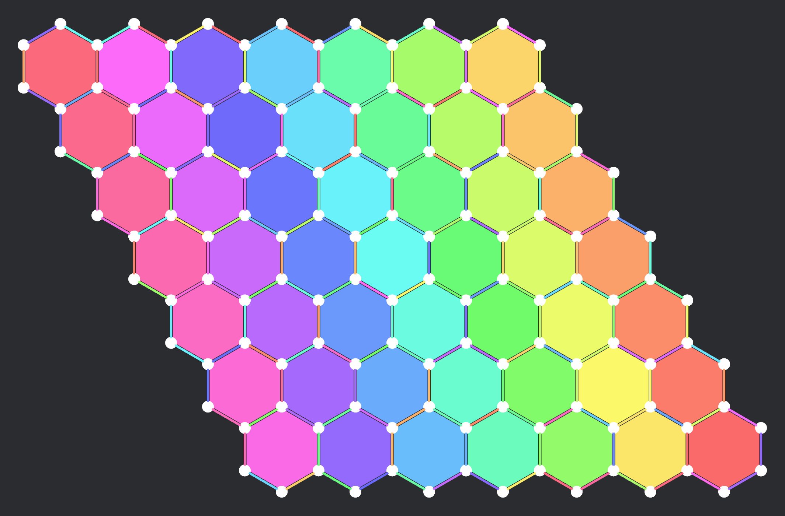

# bevy_hex_coords

A library that provides hexagonal coordinate utilities, with accurate vertex
and edge placement and rotation, for the [Bevy] game engine.

[Bevy]: https://bevy.org

> [!WARNING]
> **Not for production use.** This library was built as a learning experience
> in deriving hexagonal grid semantics from first principles. No thought has
> been put into ergonomics and there is no guarantee that I will maintain this
> in the future.D

## Installation

```sh
cargo add --git https://github.com/icorbrey/bevy_hex_coords
```

## Usage

```rust
use bevy::prelude::*;
use bevy_hex_coords::*;

fn main() {
    App::new()
        .add_plugins(DefaultPlugins)
        .add_plugins(HexCoordsPlugin {
            auto_attach_transforms: true,
        })
        .add_systems(Startup, setup)
        .run();
}

fn setup(mut commands: Commands) {
    commands.spawn((
        HexCoord::new(0, 0),
        HexUnitSize(32.0),
        Sprite::default(),
    ));
}
```

## Example

To see a demo of this library in action, run the following:

```sh
cargo run --example layout
```



## License

bevy_hex_coords is distributed under one of [MIT] or [Apache-2.0].

[MIT]: ./LICENSE-MIT
[Apache-2.0]: ./LICENSE-APACHE
